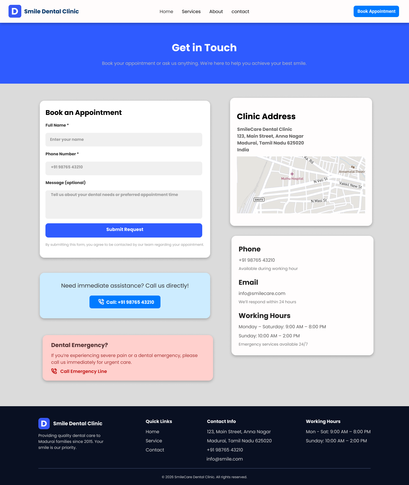
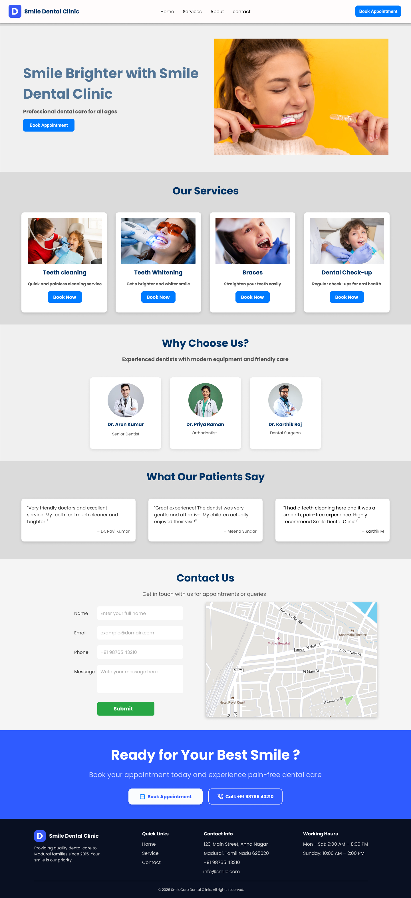
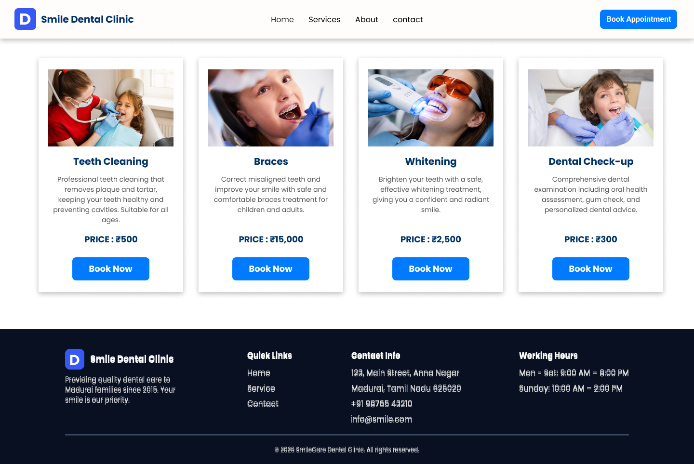

## Dental Clinic Website UI/UX Design

## Project Overview
This project is a UI/UX design of a dental clinic website created using Figma. The goal is to improve user experience and make it easy for users to book appointments.

## Features
- Clean and modern UI design
- Easy navigation
- Appointment booking section
- Contact form design
- Service showcase section

## Tools Used
Figma

## Figma Design Link:
https://www.figma.com/design/0TR4nK9hHqNAKK79uEXnwq/Clinic-ui-ux

## Prototype Link:
https://www.figma.com/proto/0TR4nK9hHqNAKK79uEXnwq/Clinic-ui-ux

## Screenshots

## 📸 Desktop Screens

## 📱 Mobile Screens

